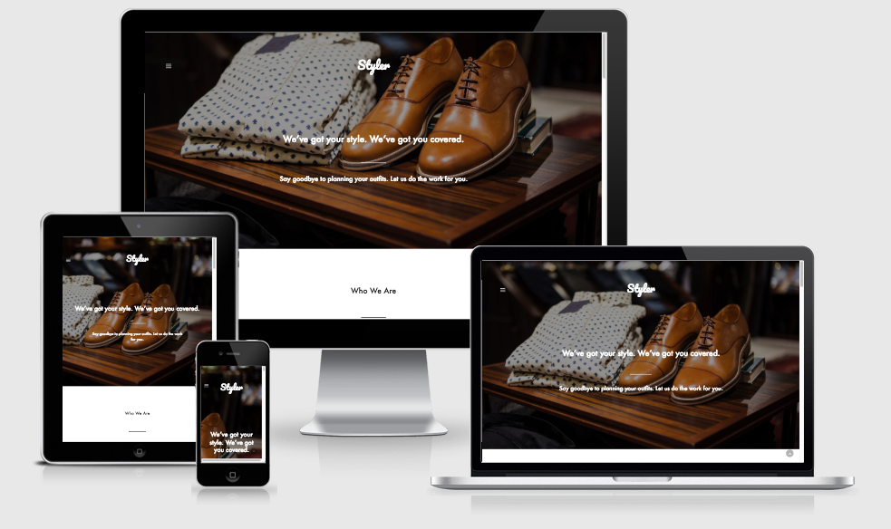

# Styler Website Example (https://lauramwall.github.io/Styler-Website-Example/)

This project was born from an idea that I had of a subscription-based clothing company. This is a fictional project that I created in my free time around April of 2018.

# Technologies Used

<ul>
  <li>HTML5</li>
  <li>CSS3/SASS</li>
  <li>Bootstrap</li>
  <li>JavaScript/jQuery</li>
  <li>FontAwesome</li>
  <li>Google Font API</li>
  <li>Brackets.io</li>
</ul>

# Screencap

# Credits

N/A
